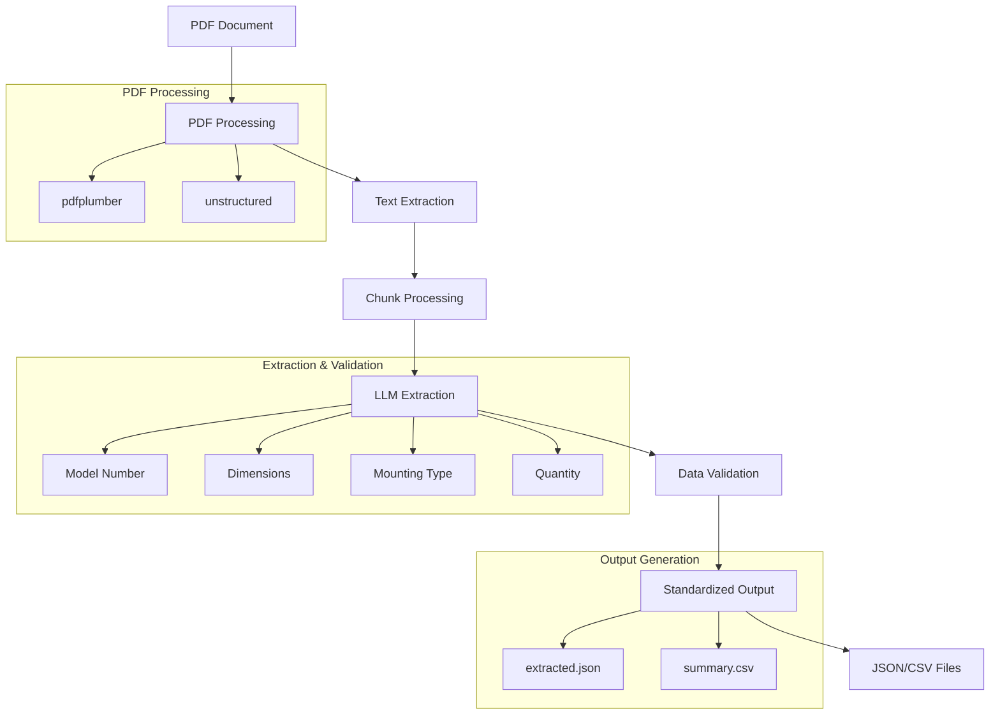

# House Plan Parser

A Python-based tool for extracting and standardizing plumbing information from house plans and construction documents.

## Features

- Extracts plumbing information from PDF documents
- Standardizes plumbing item formats
- Handles various input formats and notations
- Validates extracted data against predefined rules
- Supports parallel processing for improved performance

## Architecture Overview

The system is built using a modular architecture with the following components:

### Core Components

1. **PDF Processing Module**

   - Uses `pdfplumber` for basic PDF text extraction
   - Uses `unstructured` for layout-aware text extraction
   - Supports parallel processing for improved performance

2. **Extraction Chain**

   - Uses LangChain for structured LLM workflows
   - Processes text in chunks to handle large documents
   - Extracts and standardizes plumbing information
   - Handles various input formats and notations

3. **Validation Chain**

   - Validates extracted data against predefined rules
   - Standardizes model numbers, dimensions, and mounting types
   - Handles special cases and edge conditions
   - Ensures consistent output format

4. **Data Models**
   - Uses Pydantic models for type-safe data validation
   - Defines standard formats for plumbing items
   - Enforces validation rules for each field
   - Handles error cases gracefully

### Workflow



### Processing Steps

1. **PDF Processing**

   - Document is loaded and preprocessed
   - Text is extracted using layout-aware methods
   - Pages are processed in parallel for efficiency

2. **Text Processing**

   - Text is split into manageable chunks
   - Each chunk is processed by the LLM
   - Initial items are extracted and formatted

3. **Data Extraction**

   - Model numbers are extracted and standardized
   - Dimensions are converted to standard format
   - Mounting types are validated and formatted
   - Quantities are standardized

4. **Validation**

   - Each field is validated against rules
   - Special cases are handled
   - Invalid data is corrected or removed
   - Duplicates are eliminated

5. **Output Generation**
   - Validated items are formatted
   - Results are saved to JSON and CSV
   - Summary statistics are generated

## Installation

### Prerequisites

- Python 3.12 or higher
- [uv](https://github.com/astral-sh/uv) (recommended) or pip
- Git

### Using uv (Recommended)

1. Install uv if you haven't already:

```bash
curl -LsSf https://astral.sh/uv/install.sh | sh
```

2. Clone the repository:

```bash
git clone https://github.com/yourusername/house_plan_parser.git
cd house_plan_parser
```

3. Create and activate a virtual environment:

```bash
uv venv
source .venv/bin/activate  # On Unix/macOS
# or
.venv\Scripts\activate  # On Windows
```

4. Install dependencies:

```bash
uv pip install -r requirements.txt
```

### Using pip

1. Clone the repository:

```bash
git clone https://github.com/yourusername/house_plan_parser.git
cd house_plan_parser
```

2. Create and activate a virtual environment:

```bash
python -m venv .venv
source .venv/bin/activate  # On Unix/macOS
# or
.venv\Scripts\activate  # On Windows
```

3. Install dependencies:

```bash
pip install -r requirements.txt
```

### Dependencies

The project uses the following main dependencies:

- `pdfplumber`: For PDF text extraction
- `unstructured`: For layout-aware text extraction
- `langchain`: For LLM workflows
- `pydantic`: For data validation
- `pandas`: For data processing and CSV output

### Development Setup

For development, install additional dependencies:

```bash
uv pip install -r requirements-dev.txt
```

### Configuration

The project can be configured through environment variables:

```bash
export MODEL_NAME="llama3"  # Default LLM model
export MAX_CHUNK_SIZE=2000  # Maximum text chunk size
export PARALLEL_PROCESSING=true  # Enable parallel processing
```
