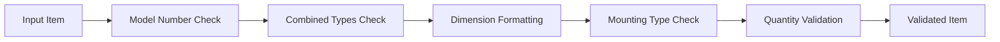

# House Plan Parser

A tool for extracting and validating plumbing data from house plan PDFs using OCR and LLM-based validation.

## Architecture

The system is built using a modular architecture with the following components:

### 1. Data Extraction Layer

- **PDF Processing**: Uses `pdfplumber` and `unstructured` for layout-aware text extraction
- **OCR Support**: Optional OCR processing using `pytesseract` for scanned documents
- **Text Chunking**: Splits large documents into manageable chunks for processing

### 2. LLM Processing Layer

- **LangChain Integration**: Uses LangChain for structured LLM workflows
- **Validation Chains**: Sequential processing of validation steps
- **Pydantic Models**: Type-safe data validation and processing

### 3. Validation Pipeline

The validation process follows a sequential chain of steps:



Each validation step:

1. **Model Number Check**: Verifies and corrects reversed model numbers
2. **Combined Types Check**: Splits items with multiple types
3. **Dimension Formatting**: Ensures consistent measurement formatting
4. **Mounting Type Check**: Validates mounting specifications
5. **Quantity Validation**: Verifies quantity values

### 4. Data Processing Flow

1. **PDF Input**

   - Document is loaded and preprocessed
   - Text is extracted using layout-aware methods
   - Optional OCR processing for scanned documents

2. **Text Processing**

   - Text is split into chunks
   - Each chunk is processed by the LLM
   - Initial items are extracted and formatted

3. **Validation Pipeline**

   - Each item goes through the validation chain
   - Multiple validation steps are applied sequentially
   - Corrections and splits are handled automatically

4. **Output Generation**
   - Validated items are deduplicated
   - Final output is formatted consistently
   - Results are saved in structured format

## Dependencies

- Python 3.12+
- PDF Processing: `pdfplumber`, `unstructured`
- OCR: `pytesseract`, `tesseract-ocr`
- LLM: `langchain`, `ollama`
- Data Processing: `pandas`, `numpy`
- Visualization: `graphviz`

## Usage

1. Install dependencies:

```bash
pip install -r requirements.txt
```

2. Run the extractor:

```bash
python extract_plumbing_data.py
```

3. Visualize the validation chain:

```python
extractor = PlumbingDataExtractor()
extractor.visualize_validation_chain()
```

## Configuration

- Model selection: `model_name` parameter in `PlumbingDataExtractor`
- Validation steps: Modify `_setup_validation_chains()`
- Processing parameters: Adjust chunk size and memory limits

## Contributing

Contributions are welcome! Please feel free to submit a Pull Request.
