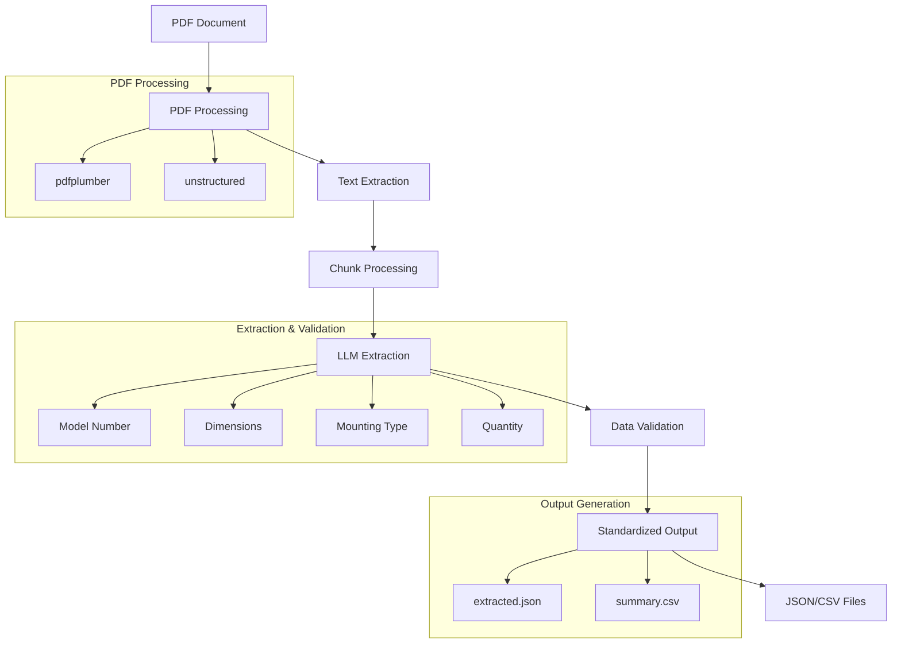

# House Plan Parser

A Python-based tool for extracting and standardizing plumbing information from house plans and construction documents.

## Features

- Extracts plumbing information from PDF documents
- Standardizes plumbing item formats
- Handles various input formats and notations
- Validates extracted data against predefined rules
- Supports parallel processing for improved performance

## Technical Architecture

The system is built using a modular architecture with the following key components:

### Core Components

1. **PDF Processing Module**

   - Uses `pdfplumber` for basic PDF text extraction
   - Uses `unstructured` for layout-aware text extraction
   - Supports parallel processing for improved performance

2. **Extraction Chain**

   - Uses LangChain for structured LLM workflows
   - Processes text in chunks to handle large documents
   - Extracts and standardizes plumbing information
   - Handles various input formats and notations

3. **Validation Chain**

   - Validates extracted data against predefined rules
   - Standardizes model numbers, dimensions, and mounting types
   - Handles special cases and edge conditions
   - Ensures consistent output format

4. **Data Models**
   - Uses Pydantic models for type-safe data validation
   - Defines standard formats for plumbing items
   - Enforces validation rules for each field
   - Handles error cases gracefully

### Workflow



### Processing Steps

1. **PDF Processing**

   - Document is loaded and preprocessed
   - Text is extracted using layout-aware methods
   - Pages are processed in parallel for efficiency

2. **Text Processing**

   - Text is split into manageable chunks
   - Each chunk is processed by the LLM
   - Initial items are extracted and formatted

3. **Data Extraction**

   - Model numbers are extracted and standardized
   - Dimensions are converted to standard format
   - Mounting types are validated and formatted
   - Quantities are standardized

4. **Validation**

   - Each field is validated against rules
   - Special cases are handled
   - Invalid data is corrected or removed
   - Duplicates are eliminated

5. **Output Generation**
   - Validated items are formatted
   - Results are saved to JSON and CSV
   - Summary statistics are generated

## Workflow Orchestration

The system uses LangGraph for workflow orchestration, providing a structured way to manage the extraction and validation process:

```python
from langgraph.graph import Graph, StateGraph

# Define workflow states
class WorkflowState(TypedDict):
    extraction_result: ExtractionResult
    validation_result: ValidationResult
    error: Optional[str]

# Create workflow graph
workflow = StateGraph(WorkflowState)

# Add nodes
workflow.add_node("extract", extract_data)
workflow.add_node("validate", validate_data)
workflow.add_node("error_handler", handle_error)

# Add edges
workflow.add_edge("extract", "validate")
workflow.add_edge("validate", "error_handler")
```

### Workflow Components

1. **State Management**

   - Uses `TypedDict` for type-safe state management
   - Tracks extraction results, validation results, and errors
   - Maintains state throughout the workflow execution

2. **Node Functions**

   - `extract_data`: Handles PDF processing and initial data extraction
   - `validate_data`: Validates and standardizes extracted data
   - `error_handler`: Manages error cases and recovery

3. **Edge Logic**
   - Defines the flow between processing stages
   - Handles error propagation
   - Manages state transitions

### Benefits

- Structured workflow management
- Clear separation of concerns
- Type-safe state handling
- Easy error management
- Extensible architecture

## Installation

### Prerequisites

- Python 3.12 or higher
- [uv](https://github.com/astral-sh/uv) (recommended) or pip
- Git

### Using uv (Recommended)

1. Install uv if you haven't already:

```bash
curl -LsSf https://astral.sh/uv/install.sh | sh
```

2. Clone the repository:

```bash
git clone https://github.com/yourusername/house_plan_parser.git
cd house_plan_parser
```

3. Create and activate a virtual environment:

```bash
uv venv
source .venv/bin/activate  # On Unix/macOS
# or
.venv\Scripts\activate  # On Windows
```

4. Install dependencies:

```bash
uv sync
```

### Using pip

1. Clone the repository:

```bash
git clone https://github.com/yourusername/house_plan_parser.git
cd house_plan_parser
```

2. Create and activate a virtual environment:

```bash
python -m venv .venv
source .venv/bin/activate  # On Unix/macOS
# or
.venv\Scripts\activate  # On Windows
```

3. Install dependencies:

```bash
uv sync
```

### Dependencies

The project uses the following main dependencies:

- `pdfplumber`: For PDF text extraction
- `unstructured`: For layout-aware text extraction
- `langchain`: For LLM workflows
- `pydantic`: For data validation
- `pandas`: For data processing and CSV output

### Development Setup

For development, install additional dependencies:

```bash
uv pip install -r requirements-dev.txt
```

## Example Output

### Processing Metrics

The system provides detailed metrics about the processing performance:

```
LLM Processing Metrics:
Memory used: 0.12 MB
CPU usage: 86.0%
Time taken: 108.07 seconds

=== PDF Processing Complete ===
```

### Extracted Data Examples

The system extracts and standardizes plumbing information into a consistent format:

```
type|quantity|model_number|dimensions|mounting_type
pipe|1|HHWS|19ft - 8 1/4 inch|-
pipe|1|HHWS|14ft - 1 inch|-
pipe|1|HHWS|9ft - 0 1/8 inch|-
pipe|1|HHWS|12ft - 9 inch|-
pipe|1|HHWS|12ft - 8 3/4 inch|-
pipe|1|HHWS|19ft - 3 3/4 inch|-
pipe|1|HHWS|19ft - 3 1/4 inch|-
pipe|1|HHWS|25ft - 1 inch|-
pipe|1|HHWS|26ft - 7 1/8 inch|-
pipe|1|HHWS|15ft - 5 3/8 inch|-
```

### Summary Output

The system generates a summary of the extracted data:

```
Extraction Summary for M&P mark-up against shop systems piping.pdf:
Total pages processed: 1
Total items found: 20

Page 4:
Found 20 items
- pipe:  (Qty: 1, Dim: 19ft 8 1/4 inch, Mount: -)
- pipe:  (Qty: 1, Dim: 14ft - 1 inch, Mount: -)
- pipe:  (Qty: 1, Dim: 9ft 0 1/8 inch, Mount: -)
- pipe:  (Qty: 1, Dim: 12ft - 9 inch, Mount: -)
- pipe:  (Qty: 1, Dim: 12ft 8 3/4 inch, Mount: -)
- pipe:  (Qty: 1, Dim: 19ft 3 3/4 inch, Mount: -)
- pipe:  (Qty: 1, Dim: 19ft 3 1/4 inch, Mount: -)
- pipe:  (Qty: 1, Dim: 25ft - 1 inch, Mount: -)
- pipe:  (Qty: 1, Dim: 26ft 7 1/8 inch, Mount: -)
- pipe:  (Qty: 1, Dim: 15ft 5 3/8 inch, Mount: -inch)
- pipe:  (Qty: 2 1/2", Dim: 19ft 9 5/8 inch, Mount: -)
- pipe:  (Qty: 2 1/2", Dim: 1ft 1 1/2 inch, Mount: -)
- pipe:  (Qty: 18' -7 1/8", Dim: - inch, Mount: -)
- pipe:  (Qty: 19' -3 1/4", Dim: 1 1/2 inch, Mount: -)
- pipe:  (Qty: 19' -3 1/4", Dim: 4 inch, Mount: -)
- pipe:  (Qty: 19' -3 1/4", Dim: 4ft 3 5/8 inch, Mount: -)
- pipe:  (Qty: 16' -5 7/8", 17' -4", 18' -5 1/8", 19' -0 3/4", 20' -0 3/4", Dim: - inch, Mount: -)
- pipe:  (Qty: 1, Dim: 3 - 2 inch, Mount: HH)
- pipe:  (Qty: 1, Dim: 0 - 1 inch, Mount: CH)
- pipe:  (Qty: 1, Dim: 1 1/2 inch, Mount: HH)
...
```

### Output Files

The system generates two types of output files:

1. `extracted_data/[filename]_extracted.json` - Detailed JSON data
2. `extracted_data/[filename]_summary.csv` - Summary in CSV format
